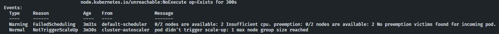

# 📧 VideoCore Notification

<div align="center">

[](https://sonarcloud.io/summary/new_code?id=FIAP-SOAT-TECH-TEAM_videocore-notification)
[](https://sonarcloud.io/summary/new_code?id=FIAP-SOAT-TECH-TEAM_videocore-notification)
[](https://sonarcloud.io/summary/new_code?id=FIAP-SOAT-TECH-TEAM_videocore-notification)
[](https://sonarcloud.io/summary/new_code?id=FIAP-SOAT-TECH-TEAM_videocore-notification)

</div>

Microsserviço de notificações por e-mail do ecossistema VideoCore, responsável por enviar notificações de status de processamento de vídeos para os usuários. Desenvolvido como parte do curso de Arquitetura de Software da FIAP (Hackaton).

<div align="center">
  <a href="#visao-geral">Visão Geral</a> •
  <a href="#repositorios">Repositórios</a> •
  <a href="#tecnologias">Tecnologias</a> •
  <a href="#infra">Infraestrutura</a> •
  <a href="#estrutura">Estrutura</a> •
  <a href="#terraform">Terraform</a> •
  <a href="#arquitetura">Arquitetura</a> •
  <a href="#dominio">Domínio</a> •
  <a href="#dbtecnicos">Débitos Técnicos</a> •
  <a href="#limitacoesqt">Limitações de Quota</a> •
  <a href="#deploy">Fluxo de Deploy</a> •
  <a href="#instalacao">Instalação</a> •
  <a href="#contribuicao">Contribuição</a>
</div><br>

> 📽️ Vídeo de demonstração da arquitetura: [https://youtu.be/k3XbPRxmjCw](https://youtu.be/k3XbPRxmjCw)<br>

---

<h2 id="visao-geral">📋 Visão Geral</h2>

<details>
<summary>Expandir para mais detalhes</summary>

O **VideoCore Notification** é o microsserviço responsável por enviar notificações por e-mail aos usuários sobre o status de processamento de seus vídeos. Ele consome eventos do Azure Service Bus e gera e-mails HTML personalizados para cada etapa do processamento.

### Principais Responsabilidades

- **Consumo de Eventos**: Escuta status de processamento via Azure Service Bus
- **Geração de E-mails**: Criação de e-mails HTML para cada status (início, conclusão, erro)
- **Envio SMTP**: Envio de e-mails via servidor SMTP configurável
- **Consulta de Usuários**: Busca dados do usuário via AWS Cognito
- **Download URLs**: Inclui link de download das imagens no e-mail de conclusão

### Fluxo de Notificação

```text
1. Evento de Status (Service Bus)
        ↓
2. Identifica tipo de notificação (STARTED / COMPLETED / FAILED)
        ↓
3. Busca dados do usuário (AWS Cognito)
        ↓
4. Gera e-mail HTML personalizado
        ↓
5. Envia e-mail via SMTP
```

### Tipos de Notificação

| Status | Descrição | Conteúdo do E-mail |
|--------|-----------|-------------------|
| `STARTED` | Processamento iniciado | Confirmação de recebimento do vídeo |
| `COMPLETED` | Processamento concluído | Link de download das imagens extraídas |
| `FAILED` | Erro no processamento | Detalhes do erro ocorrido |

</details>

---

<h2 id="repositorios">📁 Repositórios do Ecossistema</h2>

<details>
<summary>Expandir para mais detalhes</summary>

| Repositório | Responsabilidade | Tecnologias |
|-------------|------------------|-------------|
| **videocore-infra** | Infraestrutura base | Terraform, Azure, AWS |
| **videocore-db** | Banco de dados | Terraform, Azure Cosmos DB |
| **videocore-auth** | Microsserviço de autenticação | C#, .NET 9, ASP.NET |
| **videocore-reports** | Microsserviço de relatórios | Java 25, GraalVM, Spring Boot 4, Cosmos DB |
| **videocore-worker** | Microsserviço de processamento de vídeo | Java 25, GraalVM, Spring Boot 4, FFmpeg |
| **videocore-notification** | Microsserviço de notificações | Java 25, GraalVM, Spring Boot 4, SMTP |
| **videocore-frontend** | Interface web do usuário | Next.js 16, React 19, TypeScript |

</details>

---

<h2 id="tecnologias">🔧 Tecnologias</h2>

<details>
<summary>Expandir para mais detalhes</summary>

| Categoria | Tecnologia |
|-----------|------------|
| **Linguagem** | Java 25 (GraalVM) |
| **Framework** | Spring Boot 4.0.1 |
| **Mensageria** | Azure Service Bus |
| **Identity** | AWS Cognito |
| **Storage** | Azure Blob Storage |
| **E-mail** | Spring Mail (SMTP) |
| **Observabilidade** | OpenTelemetry, Micrometer, Logstash |
| **Build** | Gradle |
| **Compilação** | GraalVM Native Image |
| **Container** | Docker |
| **Orquestração** | Kubernetes (Helm) |
| **IaC** | Terraform |
| **CI/CD** | GitHub Actions |
| **Qualidade** | SonarQube |

</details>

---

<h2 id="infra">🌐 Infraestrutura</h2>

<details>
<summary>Expandir para mais detalhes</summary>

### ☸️ Recursos Kubernetes

| Recurso | Descrição |
|--------|-----------|
| **Deployment** | Pods com health probes, limites de recursos e variáveis de ambiente |
| **ConfigMap** | Configurações não sensíveis |
| **HPA** | Escalabilidade automática baseada em CPU |
| **SecretProviderClass** | Integração com Azure Key Vault para gerenciamento de segredos |

### 🔌 Integrações

| Serviço | Tipo | Descrição |
|---------|------|-----------|
| **Azure Service Bus** | Assíncrona | Consumo de eventos de status e erro |
| **AWS Cognito** | Síncrona | Busca de dados do usuário (nome, e-mail) |
| **Azure Blob Storage** | Síncrona | Geração de URLs de download de imagens |
| **SMTP** | Síncrona | Envio de e-mails de notificação |

### 🔐 Azure Key Vault Provider (CSI)

- Sincroniza secrets do Azure Key Vault com Secrets do Kubernetes
- Monta volumes CSI com `tmpfs` dentro dos Pods
- Utiliza o CRD **SecretProviderClass**

> ⚠️ Caso o valor de uma secret seja alterado no Key Vault, é necessário **reiniciar os Pods**, pois variáveis de ambiente são injetadas apenas na inicialização.
>
> Referência: <https://learn.microsoft.com/en-us/azure/aks/csi-secrets-store-configuration-options>

### 👁️ Observabilidade

- **Logs**: Envio para `NewRelic` via `Open Telemetry Collector` utilizando protocolo `OTLP + GRPC`
- **Métricas**: Envio para `NewRelic` via `Open Telemetry Collector` utilizando protocolo `OTLP + GRPC`
- **Tracing**: Envio para `NewRelic` via `Open Telemetry Collector` utilizando protocolo `OTLP + GRPC`
- **Dashboards**: Visualização na UI do `NewRelic`

</details>

---

<h2 id="estrutura">📦 Estrutura do Projeto</h2>

<details>
<summary>Expandir para mais detalhes</summary>

```text
videocore-notification/
├── notification/
│   ├── build.gradle              # Dependências e build config
│   ├── src/main/
│   │   ├── java/com/soat/fiap/videocore/notification/
│   │   │   ├── NotificationApplication.java
│   │   │   ├── core/
│   │   │   │   ├── application/
│   │   │   │   ├── domain/
│   │   │   │   └── interfaceadapters/
│   │   │   └── infrastructure/
│   │   │       ├── in/event/azsvcbus/
│   │   │       ├── out/
│   │   │       │   ├── email/
│   │   │       │   ├── cognito/
│   │   │       │   └── blobstorage/
│   │   │       └── common/
│   │   └── resources/
│   │       ├── application.yaml
│   │       ├── application-local.yaml
│   │       ├── application-prod.yaml
│   │       └── logback-spring.xml
│   └── src/test/
├── docker/
│   └── Dockerfile                # GraalVM Native Image
├── kubernetes/
│   ├── Chart.yaml                # Helm Chart
│   ├── values.yaml               # Configurações Helm
│   └── templates/
│       ├── deploymentset.yaml
│       ├── configmap.yaml
│       └── crd/
│           └── azure_secrets_provider/
├── terraform/
│   ├── main.tf                   # Helm deployment
│   └── variables.tf
├── docs/                         # Assets de documentação
└── .github/workflows/
    ├── ci.yaml                   # Build, test, SonarQube
    └── cd.yaml                   # Docker + Helm deploy
```

</details>

---

<h2 id="terraform">🗄️ Módulos Terraform</h2>

<details>
<summary>Expandir para mais detalhes</summary>

O código `HCL` desenvolvido segue uma estrutura modular:

| Módulo | Descrição |
|--------|-----------|
| **helm** | Implantação do Helm Chart da aplicação, consumindo as informações necessárias via `Terraform Remote State` |

> ⚠️ Os outpus criados são consumidos posteriormente em pipelines via `$GITHUB_OUTPUT` ou `Terraform Remote State`, para compartilhamento de informações. Tornando, desta forma, dinãmico o provisionamento da infraestrutura.

</details>

---

<h2 id="arquitetura">🧱 Arquitetura</h2>

<details>
<summary>Expandir para mais detalhes</summary>

### 📌 Princípios Adotados

- **DDD**: Bounded context de pedido isolado
- **Clean Architecture**: Domínio independente de frameworks
- **Separação de responsabilidades**: Cada camada tem responsabilidade bem definida
- **Independência de frameworks**: Domínio não depende de Spring ou outras bibliotecas
- **Testabilidade**: Lógica de negócio isolada facilita testes unitários
- **Inversão de Dependência**: Classes utilizam abstrações, nunca implementações concretas diretamente
- **Injeção de Dependência**: Classes recebem via construtor os objetos que necessitam utilizar
- **SAGA Coreografada**: Comunicação assíncrona via eventos
- **Comunicação Síncrona Resiliente**: Embora ainda não possua comunicações síncronas, apenas assíncronas, caso o projeto evolua, serão implementadas usando padrões de resiliência como Circuit Beaker e Service Discovery
- **Observabilidade**: O microsserviço está inteiramente instrumentado, com logs, tracing e métricas, via API do `Open Telemetry` (baixo acoplamento). Para logs, adota-se o conceito de **Log Canônico**.

### 🎯 Clean Architecture

O projeto segue os princípios de **Clean Architecture** com separação clara de responsabilidades:

```text
core/
├── application/          # Casos de uso
│   ├── CreateEmailNotificationStartedProcessUseCase
│   ├── CreateEmailNotificationFinishedProcessUseCase
│   ├── CreateEmailNotificationErrorProcessUseCase
│   ├── SendEmailUseCase
│   ├── GetUserByIdUseCase
│   └── GetVideoImagesDownloadUrlUseCase
├── domain/               # Entidades e regras de negócio
└── interfaceadapters/
    ├── controller/       # Controllers de processamento
    │   ├── ProcessVideoStatusUpdateController
    │   └── ProcessVideoErrorController
    └── mapper/           # Conversão de eventos ↔ domínio

infrastructure/
├── in/                   # Adaptadores de entrada
│   └── event/azsvcbus/   # Listeners do Azure Service Bus
├── out/                  # Adaptadores de saída
│   ├── email/            # Envio de e-mails (SMTP)
│   ├── cognito/          # Cliente AWS Cognito
│   └── blobstorage/      # Acesso ao Azure Blob Storage
└── common/               # Configurações e observabilidade
```

### 📊 Diagrama de Arquitetura: Saga Coreografado


</details>

---

<h2 id="dominio">📽️ Domínio</h2>

<details>
<summary>Expandir para mais detalhes</summary>

### 📖 Dicionário de Linguagem Ubíqua

| Termo | Descrição |
|-------|-----------|
| **Usuário** | Pessoa que recebe notificações sobre o processamento de seus vídeos na plataforma. |
| **Notificação** | Mensagem enviada ao usuário para informá-lo sobre o status do processamento de um vídeo (início, conclusão ou erro). |
| **E-mail de Notificação** | Comunicação enviada por e-mail ao usuário, contendo informações personalizadas sobre o status do vídeo. |
| **Status do Processamento** | Situação atual do processamento do vídeo, podendo ser iniciado, concluído ou com erro. |
| **Mensagem** | Conteúdo textual da notificação enviada ao usuário, explicando o status ou resultado do processamento. |
| **Assunto** | Linha de assunto do e-mail de notificação, resumindo o motivo do contato. |
| **Destinatário** | Usuário que irá receber a notificação por e-mail. |
| **Nome do Destinatário** | Nome do usuário utilizado para personalizar a saudação e o conteúdo do e-mail. |
| **Evento de Processamento** | Ocorrência relevante no ciclo de vida do vídeo (início, conclusão, erro) que dispara o envio de uma notificação. |
| **Link de Download de Imagens** | Endereço fornecido ao usuário para baixar as imagens extraídas do vídeo processado, incluído no e-mail de conclusão. |
| **Erro de Notificação** | Situação em que não foi possível enviar a notificação ao usuário devido a problemas técnicos ou de dados. |
| **Consulta de Usuário** | Ação de buscar informações do usuário (nome, e-mail) para personalizar e direcionar a notificação. |

### 📊 Diagrama de Domínio e Sub-Domínios (DDD Estratégico)


</details>

---

<h2 id="dbtecnicos">⚠️ Débitos Técnicos</h2>

<details>
<summary>Expandir para mais detalhes</summary>

| Débito | Descrição | Impacto |
|--------|-----------|---------|
| **Workload Identity** | Usar Workload Identity para Pods acessarem recursos Azure (atual: Azure Key Vault Provider) | Melhora de segurança e gestão de credenciais |
| **SMS** | Implementar disparo de notificações via SMS | Melhoria na comunicação com o usuário final |
| **Migrar Linguagem Compilada** | Para máximizar a performance deste microsserviço, utilizou-se a GraalVM para criação de uma imagem nativa. Embora os ganhos sejam notórios, observou-se o uso intensivo de `JNI`, `Reflections`, entre outras coisas, e o compilador precisa conhecer tudo que for dinãmico em tempo de build [(Reachability Metadata)](notification/src/main/resources/META-INF/README.md). Neste sentido, utilizar uma linguagem nativamente compilada (Go, Rust...) pode trazer ganhos de manutenção no futuro | Melhora da manutenabilidade |
| **Implementar DLQ** | Implementar lógica de reprocessamento do evento de disparo de notificações, em caso de falha | Resiliência |
| **Implementar BDD** | Utilizar abordagem BDD para desenvolvimento de testes de integração em fluxos críticos | Testabilidade |

</details>

---

<h2 id="limitacoesqt">📉 Limitações de Quota (Azure for Students)</h2>

<details>
<summary>Expandir para mais detalhes</summary>

A assinatura **Azure for Students** impõe as seguintes restrições:

- **Região**: com base em uma policy específica de assinatura;

- **Quota de VMs**: Apenas **2 instâncias** do SKU utilizado para o node pool do AKS, tendo um impacto direto na escalabilidade do cluster. Quando o limite é atingido, novos nós não podem ser criados e dão erro no provisionamento de workloads.

### Erro no CD dos Microsserviços

Durante o deploy dos microsserviços, Pods podem ficar com status **Pending** e o seguinte erro pode aparecer:




**Causa**: O cluster atingiu o limite máximo de VMs permitido pela quota e não há recursos computacionais (CPU/memória) disponíveis nos nós existentes.

**Solução**: Aguardar a liberação de recursos de outros pods e reexecutar CI + CD.

</details>

---

<h2 id="deploy">⚙️ Fluxo de Deploy</h2>

<details>
<summary>Expandir para mais detalhes</summary>

### Pipeline CI

1. **Build**: JDK 25, Gradle com cache
2. **Testes**: Execução de testes automatizados
3. **SonarQube**: Análise de qualidade de código
4. **Terraform**: Format, validate, plan

### Pipeline CD

1. **Docker**: Build de imagem GraalVM Native
2. **ACR**: Push para Azure Container Registry
3. **Helm**: Deploy no AKS com versionamento

### Autenticação das Pipelines

- **Azure:**
  - **OIDC**: Token emitido pelo GitHub
  - **Azure AD Federation**: Confia no emissor GitHub
  - **Service Principal**: Autentica sem secret

### Ordem de Provisionamento

```text
1. videocore-infra          (AKS, VNET, APIM, etc)
2. videocore-db             (Cosmos DB)
3. videocore-auth           (Microsserviço de autenticação)
4. videocore-reports        (Microsserviço de relatórios)
5. videocore-worker         (Microsserviço de processamento)
6. videocore-notification   (Microsserviço de notificações)
7. videocore-frontend       (Aplicação SPA Web)
```

### Proteções

- Branch `main` protegida
- Nenhum push direto permitido
- Todos os checks devem passar

</details>

---

<h2 id="instalacao">🚀 Instalação e Uso</h2>

<details>
<summary>Expandir para mais detalhes</summary>

### Desenvolvimento Local

```bash
# Clonar repositório
git clone https://github.com/FIAP-SOAT-TECH-TEAM/videocore-notification.git
cd videocore-notification/notification

# Configurar variáveis de ambiente
cp env-example .env

# Compilar
./gradlew build

# Executar
./gradlew bootRun
```

### Health Check

Após iniciar a aplicação:
- **Actuator**: http://localhost:${SERVER_PORT}/actuator/health

</details>

---

<h2 id="contribuicao">🤝 Contribuição</h2>

<details>
<summary>Expandir para mais detalhes</summary>

### Fluxo de Contribuição

1. Crie uma branch a partir de `main`
2. Implemente suas alterações
3. Execute os testes unitários: `./gradlew test`
4. Abra um Pull Request
5. Aguarde aprovação de um CODEOWNER

### Licença

Este projeto está licenciado sob a MIT License.

</details>

---

<div align="center">
  <strong>FIAP - Pós-graduação em Arquitetura de Software</strong><br>
  Hackaton (Tech Challenge 5)
</div>
